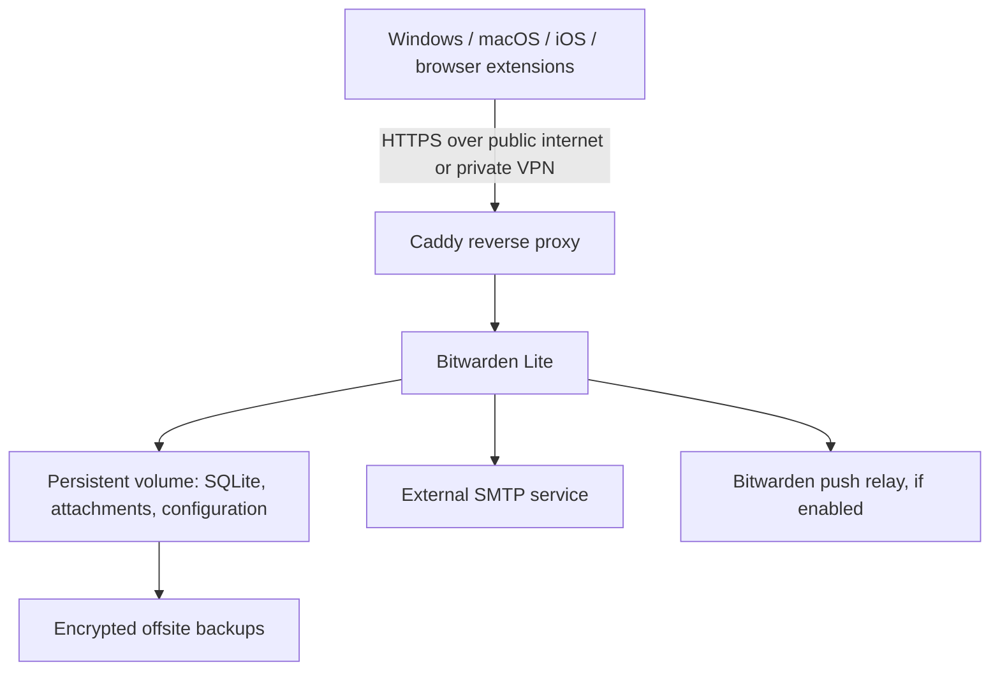

# Home-hosted Bitwarden design plan

Date: 2026-10-05

Status: Planning; deployment has not started.

## Goal

Run a Bitwarden-compatible password vault on home infrastructure, accessible from Windows, macOS, and iOS devices, with two-step login using Google Authenticator.

## Decisions and proposed defaults

| Item | Status | Direction |
| --- | --- | --- |
| Hosting location | Decided | Home hosting |
| Host platform | Decided | Windows 11 home PC running VMware Workstation; currently version 15.5.7 |
| Linux guest | Decided | Ubuntu Server 24.04 LTS x86_64, terminal-only; no desktop GUI |
| Client platforms | Decided | Windows, macOS, and iOS |
| Backend ownership | Decided | Self-hosted server |
| Two-step login | Requested capability | Support Google Authenticator using TOTP; enable it on each account |
| Server implementation | Recommended default | Official Bitwarden Lite |
| Deployment | Recommended default | Docker Compose on an always-on Linux host |
| Database | Recommended default | SQLite for personal or family use |
| HTTPS proxy | Recommended default | Caddy with a certificate trusted by all devices |
| Client distribution | Recommended default | Standard Bitwarden apps configured with the self-hosted URL |
| Backups | Recommended default | Daily encrypted offsite backups and backups before upgrades |

Home hosting is confirmed. The recommended defaults above are a proposed baseline, rather than separately confirmed choices. This plan assumes personal or family use; business use would require revisiting the deployment variant.

## Proposed architecture

Use one stable server address, such as `https://vault.example.com`, across all clients. The actual domain and access method remain open.

### Home host

- Run a Linux VM on the existing Windows 11 home PC using VMware Workstation.
- Recommend upgrading Workstation 15.5.7 to a maintained version that supports the installed Windows 11 release before production use. Confirm guest compatibility with the selected VMware release.
- Use Ubuntu Server 24.04 LTS x86_64 without a desktop environment. Enable OpenSSH Server for remote administration and retain the VMware console for setup and troubleshooting.
- Start with 2 virtual CPUs, approximately 2 GB RAM, and a 30 GB virtual disk as practical headroom, rather than minimum requirements. Increase storage for attachments and backup staging.
- Enable automatic startup after reboot, container restart policies, operating system security updates, and time synchronization.
- Disable Windows sleep/hibernation while the server is expected to be available. Test VM and application recovery after Windows reboot or updates.
- Store application data on the Linux guest filesystem. Use guest-aware backups; VMware snapshots are supplementary and do not replace offsite backups.
- Keep application data on persistent storage. Consider a UPS if home power interruptions are frequent.

### Application and database

- Run the official `ghcr.io/bitwarden/lite` image with a pinned version.
- Use SQLite initially to avoid operating a separate database service for a small number of users.
- Mount `/etc/bitwarden` persistently and identify any additional configured attachment or data paths before implementing backups.
- Obtain the installation ID and key required by the official deployment.
- Keep deployment configuration in a separate server deployment directory or repository. This clients repository contains client applications, not the backend implementation.
- Treat PostgreSQL as an option if future usage or operational requirements justify it.

### HTTPS and remote access

Two alternatives remain under consideration:

| Access method | Benefits | Requirements and tradeoffs |
| --- | --- | --- |
| Public HTTPS | Clients connect directly from home Wi-Fi or cellular networks | Trusted TLS certificate, stable DNS, firewall configuration, and an internet-reachable endpoint; check ISP CGNAT and dynamic addressing |
| VPN-only | Vault endpoint is reachable only through the private network | Every remote device needs VPN access; trusted HTTPS and hostname resolution are still required |

Expose only the intended proxy endpoint. Keep the application port and database private. Configure proxy support for the server's notification connections.

Use Bitwarden's own authentication. An additional interactive proxy login page can prevent native clients from connecting.

## Authentication

Use a strong, unique master password and enable authenticator-based two-step login on every account. Google Authenticator supplies the TOTP codes; this requires no custom client implementation.

Enrollment procedure:

1. Open the self-hosted web vault.
2. Navigate to **Settings → Security → Two-step login**.
3. Select **Authenticator App → Manage**.
4. Scan the QR code with Google Authenticator.
5. Enter the generated six-digit code to enable the method.
6. Record the recovery code outside the vault.
7. Keep the current web session open while testing a fresh login on another session or device.
8. Verify login from Windows, macOS, and iOS.

Two-step login applies to account sign-ins. Unlocking an already signed-in client is a separate operation and does not necessarily request a TOTP code. Remembered devices can also affect when prompts appear.

Keep the authenticator available independently of the vault it protects. Store recovery materials securely so they remain accessible if the phone is lost or the server is unavailable.

## Email and mobile synchronization

- Configure an external SMTP service for account verification, invitations, and notifications as needed.
- Retain Bitwarden push relay support if automatic mobile synchronization is desired. This introduces an outbound dependency on Bitwarden's relay service.
- Disabling push relay leaves manual synchronization available but affects automatic mobile behavior.
- Validate synchronization between desktop and iOS clients after deployment.

## Backups and recovery

Proposed recovery objectives are a maximum of 24 hours of data loss and restoration within one day, assuming replacement hardware and backup access are available. Confirm these targets before deployment.

- Back up the database, attachments, configuration, and required server keys together.
- For SQLite, use a database-aware backup or briefly stop the application before copying persistent data. Avoid relying on an ordinary copy of an actively changing database.
- Encrypt backups and send a copy to storage outside the home host.
- Proposed retention: 7 daily, 4 weekly, and 6 monthly recovery points.
- Keep backup decryption credentials accessible independently of Bitwarden.
- Test restoration on a separate host before relying on the server, and repeat periodically.
- Take a backup before every application upgrade. Database migrations may require restoring that backup to roll back safely.

## Operations

- Monitor service health, disk space, certificate renewal, and backup success.
- Apply server updates deliberately, with a backup and a client login/sync check afterward.
- Restrict registrations after onboarding if the selected server configuration supports the desired policy.
- Keep administrative access private and protect deployment secrets from version control.
- Document the server hostname, storage paths, deployment commands, backup process, and restore procedure.

## Client strategy

Use the official Windows, macOS, and iOS apps and browser extensions. Configure their self-hosted server URL before signing in. Self-hosting alone does not require rebuilding the clients.

The macOS app can also be built from this repository if customization is later required. That is a separate workstream involving npm dependencies, Rust native modules, and signing/notarization for distribution. No client build has been completed during this planning work.

## Resolved questions

1. **Host and operating system — closed:** Use the existing Windows 11 home PC with VMware Workstation and an Ubuntu Server 24.04 LTS x86_64 guest, terminal-only with no desktop GUI. VMware is currently version 15.5.7; upgrading it and allocating VM resources remain implementation tasks.

## Open questions

Question numbers are retained from the original plan.

2. Is this exclusively personal/family use, and how many accounts are expected?
3. Should remote clients connect directly over public HTTPS or use a VPN?
4. Is a domain already available? Does the home ISP provide a public address, or use CGNAT?
5. Which SMTP provider and offsite backup destination will be used?
6. Are the proposed recovery objectives and backup retention acceptable?
7. Are any paid Bitwarden features needed? Confirm their self-hosted licensing requirements before deployment.

## Implementation sequence

1. Resolve usage scope, network access, and domain choices.
2. Upgrade VMware to a suitable maintained release, allocate VM resources, install Ubuntu Server with OpenSSH, and prepare Docker Compose.
3. Create deployment configuration with pinned images and persistent storage.
4. Configure HTTPS, SMTP, and optional push relay connectivity.
5. Create accounts and enroll Google Authenticator two-step login.
6. Configure all clients and test login, vault edits, attachments if used, and synchronization.
7. Implement encrypted offsite backups and complete a restore test.
8. Record maintenance and recovery procedures before storing production credentials.

## References

- [Official Bitwarden Lite deployment](https://bitwarden.com/help/install-and-deploy-lite/)
- [Configure clients for a self-hosted server](https://bitwarden.com/help/change-client-environment/)
- [Authenticator two-step login](https://bitwarden.com/help/setup-two-step-login-authenticator/)
- [Two-step login recovery code](https://bitwarden.com/help/two-step-recovery-code/)
- [Push relay configuration](https://bitwarden.com/help/configure-push-relay/)
- [Server backup guidance](https://bitwarden.com/help/backup-on-premise/)
- [Vaultwarden alternative](https://github.com/dani-garcia/vaultwarden)
- [Docker Engine installation on Ubuntu](https://docs.docker.com/engine/install/ubuntu/)
- [Alpine release and package support policy](https://alpinelinux.org/releases/)
- [Docker on Alpine](https://wiki.alpinelinux.org/wiki/Docker)
- [VMware Workstation host support matrix](https://knowledge.broadcom.com/external/article?legacyId=80807)

Vaultwarden was considered as an unofficial compatible alternative. Official Bitwarden Lite remains the recommended baseline for this plan.
